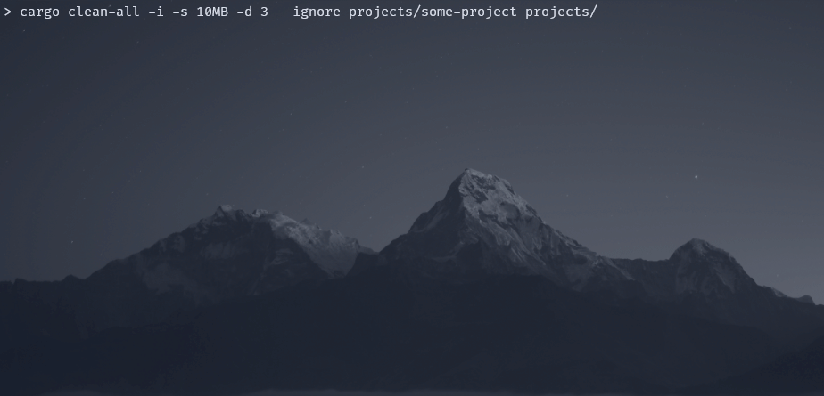

# cargo-clean-all
[](https://crates.io/crates/cargo-clean-all)
[](https://crates.io/crates/cargo-clean-all)



## Why does it exist
I was a bit shocked when I realized that my rust target directories took up a total of over 50gb, 
so I developed this tool to help me clean up all the project target dirs. There is already 
[cargo-clean-recursive](https://github.com/IgaguriMK/cargo-clean-recursive) which unfortunately 
doesn't support interactive selections or keeping recent files in order to not slow down the 
projects I'm currently working on.

## What does it do

This is a custom `cargo` subcomand that searches all rust cargo projects in a given parent 
directory and deletes the build artifacts (aka target directories). Before cleanup it shows the 
amount of disk space that can be freed up. Specific projects can be excluded from cleaning using 
an interactive selection, and/or CLI filters. The CLI filters can exclude projects that have been 
compiled in the last X days, have a target directory that is smaller than X, or are specifically 
ignored.


**The actual cleaning consists of simply deleting the target directories from the detected projects,
which seems to be what `cargo clean` does by default**

## Installation

Install using cargo:
```
cargo install cargo-clean-all
```

## Usage

Clean all projects in the current working directory with the possibility to 
interactively deselect projects
```
cargo clean-all -i
```

Clean all projects in the home directory (and subdirectories) that haven't been compiled in the 
last 7 days without interactive mode. This will still show the projects and ask for confirmation, 
but won't show the manual selection dialog
```
cargo clean-all --keep-days 7 ~
```

Clean all projects in the home directory (and subdirectories) that take up more than 10MB with 
interactive mode.
```
cargo clean-all -i --keep-size 10MB ~
```

Clean all projects in the home directory (and subdirectories), excluding the Download and Documents 
directories. Since interactive mode is used, the projects in the ignored directories may still be
manually added to the cleanup run.
```
cargo clean-all -i --ignore ~/Downloads --ignore ~/Documents ~
```

# Alternatives

## [cargo-clean-recursive](https://github.com/IgaguriMK/cargo-clean-recursive)

| Feature      | `cargo-clean-all` | `cargo-clean-recursive` |
|------------------------------------------------|:---:|:---:|
| Clean projects under current dir               | yes | yes |
| Clean projects under any dir                   | yes | no  |
| Display freed up / freeable disk space         | yes | no  |
| Keep target dirs below a size threshold        | yes | no  |
| Keep target dirs with a last modified treshold | yes | no  |
| Ask before cleaning                            | yes | no  |
| Interactive selection of projects              | yes | no  |
| Clean only `release`, `debug` or `docs`        | no (not yet)  | yes |
| Real `cargo clean` command under the hood      | no  | yes |
| Keep executables in an extra directory         | yes | no  |

Note that `cargo-clean-recursive` uses the actual `cargo clean` command under the hood instead of 
simply deleting the target directories. This makes the cleaning work exactly as intended by 
the installed version of cargo, which can certainly be desirable in some cases.

---
## Manual

```
Recursively clean all cargo projects in a given directory that match the specified criteria

Usage: cargo clean-all [OPTIONS] [DIR]

Arguments:
  [DIR]  The directory in which the projects will be searched [default: .]

Options:
  -y, --yes                Don't ask for confirmation; Just clean all detected projects that are not excluded by other constraints
  -s, --keep-size <SIZE>   Ignore projects with a target dir size smaller than the specified value. The size can be specified using binary prefixes like "10MB" for 10_000_000 bytes, or "1KiB" for 1_024 bytes [default: 0]
  -d, --keep-days <DAYS>   Ignore projects that have been compiled in the last [DAYS] days. The last compilation time is infered by the last modified time of the contents of target directory [default: 0]
      --dry-run            Just collect the cleanable projects and list the freeable space, but don't delete anything
  -t, --threads <THREADS>  The number of threads to use for directory scanning. 0 automatically selects the number of threads [default: 0]
  -v, --verbose            Show access errors that occur while scanning. By default those errors are hidden
  -i, --interactive        Use the interactive project selection. This will show a selection of all cleanable projects with the possibility to manually select or deselect
      --ignore <IGNORE>    Directories that should be ignored by default, including subdirectories. This will still detect the projects in those directories, but mark them to not be cleaned. To actually skip scanning directories, use --skip instead. The directories can be specified as absolute paths or relative to the workdir
  -e, --keep-executable    Keeping compiled executables in release, debug and cross-compilation directories. Moves the executable to a new folder outside of target
      --skip <SKIP>        Directories that should be fully skipped during scanning, including subdirectories. This will speed up the scanning time by not doing any reads for the specified directories. The directories can be specified as absolute paths or relative to the workdir
  -h, --help               Print help information
  -V, --version            Print version information
```
